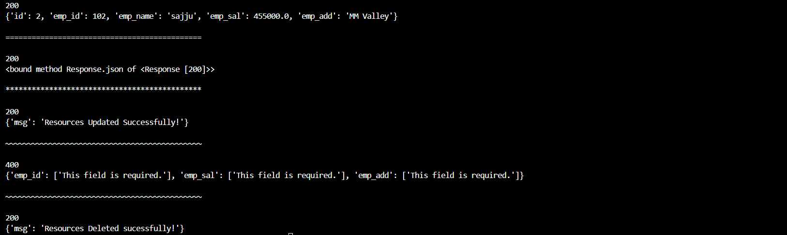

#  Django DRF Employee CRUD API (CBV)

This project is a simple **Employee Management REST API** built using **Django REST Framework (DRF)** with **Class-Based Views (CBV)**.

It demonstrates full CRUD operations using JSON-based requests and a separate Python test client using the `requests` library.

---

##  Features

- Create Employee (POST)
- Fetch Employee / All Employees (GET)
- Full Update (PUT)
- Partial Update (PATCH)
- Delete Employee (DELETE)
- JSON based API communication
- Custom test client using Python `requests`

---

##  Tech Stack

* **Backend:**  
  
  &nbsp;&nbsp;
  

* **Database:**  
  

---

### 🖥️ Terminal Output

---

## 📁 Project Structure

testapp/
  ├── models.py
  ├── views.py (CBV CRUD API)
  ├── serializers.py
  ├── tests.py (API test client)

---

## ⚠️ Important Notes
- API expects JSON input  
- CSRF is disabled for testing purposes  
- ID must exist for update and delete operations

## 📚 Learning Outcomes

- Django REST Framework basics  
- Class-Based API Views (CBV)  
- JSON parsing and rendering in APIs  
- API testing using Python `requests` library  
- Understanding CRUD architecture in REST APIs  

---
## 👨‍💻 Author

**Sajjad Ali**

## 🤝 Connect with Me

Agar aapke paas koi sawal hai ya aap connect karna chahte hain, toh aap mujhe niche diye gaye platforms par reach out kar sakte hain:  
<i>If you have any questions or would like to connect, feel free to reach out to me on the platforms below:"</i>

* **LinkedIn:**  
  

* **Gmail:**  
  

---

## 💖 Support & Usage
If you find this project helpful or plan to use it as a template for your learning, please consider:
1. Giving it a **Star ⭐**
2. Giving credit to the original author means me Your Sajju 🔥✨

---

## 🧪 Run Test Client
  \modelSerilizer\testapp> py tests.py

